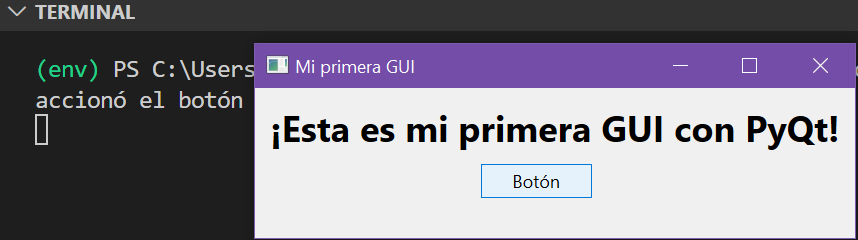

# Guía de PyQt

Esta guía está diseñada para proporcionar una introducción al desarrollo de aplicaciones GUI (Interfaz Gráfica de Usuario) utilizando PyQt.

## ¿Qué es Qt?

Qt es un framework de desarrollo de software multiplataforma (C++), utilizado para crear aplicaciones con interfaces gráficas de usuario (GUI). Desarrollado por la empresa noruega Qt Company, Qt ofrece una amplia gama de herramientas y bibliotecas para desarrollar aplicaciones de escritorio, móviles y embebidas. Qt proporciona un conjunto completo de widgets y herramientas para crear interfaces gráficas atractivas y funcionales, así como capacidades para renderizado 2D y 3D. Se basa en un sistema de **señales** y **slots** para manejar eventos y comunicar acciones entre diferentes partes de la aplicación.

## ¿Qué es PyQt?

PyQt es una biblioteca que ofrece un conjunto de enlaces Python para el framework Qt, desarrollado por la empresa británica Riverbank Computing. PyQt permite a los desarrolladores de Python utilizar las funcionalidades de Qt para crear aplicaciones GUI potentes y flexibles.

## Primeros Pasos

### Instalación de PyQt

Para comenzar a desarrollar con PyQt, primero se necesita instalar el paquete en el entorno de Python. Se puede instalar PyQt5 o PyQt6 según las preferencias y necesidades.

Se puede utilizar pip, el gestor de paquetes de Python. 

```bash
pip install pyqt5
```

Si prefiere usar PyQt6, simplemente reemplace "pyqt5" con "pyqt6" en el comando anterior.

Luego de haber instalado el paquete, puede usarlo para desarrollar su aplicación, a continuación se muestra un ejemplo sencillo (el código fuente lo encuentra en [code/getting_started_1.py](./code/getting_started_1.py)).



#### Qt Designer 
Esta es una herramienta que permite diseñar interfaces de usuario de forma visual de la forma conocida como *what-you-see-is-what-you-get* (WYSIWYG). Aunque no es necesario para trabajar con PyQt, puede acelerar significativamente el tiempo de desarrollo al permitirte crear interfaces de usuario de manera más eficiente simplemente arrastrando y soltando los diferentes widgets (*drag-and-drop*).[^2]

Qt Designer es independiente de la plataforma y del lenguaje de programación. No produce código en ningún lenguaje de programación en particular, pero crea archivos `.ui`, los cuales son archivos XML con descripciones detalladas de cómo generar GUI basadas en Qt.[^2]

Se puede traducir el contenido de los archivos `.ui` a código Python con `pyuic5[ó 6]`, que es una herramienta de línea de comandos que viene con PyQt. También se puede leer directamente los archivos `.ui` y cargar su contenido para generar la GUI asociada.[^2]

De las varias formas que hay para instalarlo, se puede usar pip para instalar pyqt5-tools, que entre otras herramientas de Qt, incluye Qt Designer.

```bash
pip install pyqt5-tools
```
Una vez instalado, se puede lanzar la aplicación por linea de commandos con la sentencia `designer`, o se puede buscar el ejecutable en la ruta donde se instalo (que debería ser algo como: Windows: `...Lib\site-packages\pyqt5_tools\designer.exe`; Linux: `...lib/python3.x/site-packages/qt5_applications/Qt/bin/designer`) [^2]. Esto abrira una interfaz como esta:


## ¿Cómo desarrollar la interfaz?

Para desarrollar la aplicación, debes tener en cuenta las siguientes pautas [^1]:

1. En el código debe haber una instancia de la clase `QtWidgets.QApplication`. Esta es el núcleo de cualquier aplicación PyQt y gestiona el flujo de control de la aplicación, así como sus configuraciones principales. Algunas de sus responsabilidades específicas son:
   - El manejo de inicialización y finalización de la aplicación.
   - Proveer el bucle principal de los eventos y su manejador.

    Por eso, tu código siempre debe contener:

    ```python
    import sys
    from PyQt5.QtWidgets import QApplication

    app = QApplication(sys.argv)
    # ...
    # ... Desarrolla tu interfaz gráfica aquí...
    # ...

    sys.exit(app.exec())
    ```

    En el código anterior, el bucle de eventos de la aplicación es desencadenado con `.exec()`, y este se incrusta en `sys.exit()` para asegurar que la aplicación de Python se cierre y se limpie de la memoria correctamente.

2. La creación de la interfaz gráfica se logra a través de la instancia y organización de los diferentes widgets que Qt ofrece (`QLabel`, `QPushButton`, `QMainWindow`, etc), y definiendo la interacción con el usuario a través de la asignación de **SLOTS** (métodos-funciones-rutinas) en respuesta a las diferentes acciones desencadenadas por el usuario. Estas acciones se conocen como **SIGNALS** (eventos: click, movimiento de mouse, etc.) y cada widget tendrá asociados sus propios eventos. La sintaxis general para hacer la asignación de slots a una señal es:

    ```python
    widget.signal.connect(slot_function)
    ```

    Si una señal se conecta a un slot, este se ejecutará cada vez que la señal sea emitida por el widget. Si una señal no tiene asociado un slot, no pasará nada y la señal será ignorada por el capturador de eventos. Algunas de las características a considerar son:
   - Una señal se puede conectar a más de un slot.
   - Una señal se puede conectar a otra señal.
   - Un slot puede conectarse a más de una señal.

> [!Note]
> Aunque la gran cantidad de widgets y señales son más que suficientes para la mayoría de las aplicaciones, a veces se requieren objetos más personalizados. Con PyQt, esto no es un gran problema, ya que siempre se pueden crear widgets personalizados heredando las propiedades de los predefinidos, o directamente de `QWidget`. También se pueden usar las clases disponibles en `QtCore`.

3. La ejecución del bucle principal se da en un hilo principal (Thread GUI, main Thread, etc.). En ocasiones, cuando la respuesta a las acciones de los usuarios requiere largos tiempos de procesamiento, para evitar que se congele la interfaz mientras se ejecutan las tareas, se puede recurrir a hilos adicionales para ejecutarlas en segundo plano sin bloquear la interfaz de usuario principal. Esto se puede hacer utilizando la clase `QThread` para crear y administrar hilos. Revisar el 5 enlace del [material](####Enlaces) que se dejó al final. 

4. El uso de Qt Designer es más que recomendado. Esta herramienta disminuirá mucho el tiempo de desarrollo y la cantidad de código necesario para tener aplicaciones de calidad. El archivo `.ui` que se obtiene de Qt Designer, como se dijo antes, puede transformarse en código de Python usando:

    ```bash
    pyuic5 -x <nombre_archivo_ui> -o <nombre_archivo_py>
    ```

    Por otro lado, esta conversión no es necesaria en todos los casos; a veces, basta con importarlo dentro de otro código de Python mediante:

    ```python
    from PyQt5.uic import loadUi
    # ...
    loadUi("qtDesigner_interface.ui")
    # ...
    ```

5. Los estilos de la aplicación pueden ser configurados, ya sea utilizando los predefinidos, o utilizando **QSS** (Qt Style Sheets) para configurar la apariencia de cada objeto con una sintaxis similar a CSS.

   Los estilos predefinidos disponibles dependerán principalmente del sistema operativo. En algunos sistemas estarán disponibles estilos como: `Breeze`, `Oxygen`, `QtCurve`, `Windows` o `Fusion`. Para revisar los que tienes disponibles, puedes usar el siguiente código:

   ```python 
    >>> import PyQt5.QtWidgets
    >>> print(PyQt5.QtWidgets.QStyleFactory.keys())
    ['windows11', 'windowsvista', 'Windows', 'Fusion']
   ```

    Por otro lado, si optas por la personalización manual, hay que tener en cuenta la sintaxis del style sheet de Qt (QSS), que, aunque es similar a CSS, no es igual, principalmente porque es más limitado. Aquí, las reglas de estilo se componen de un selector y una declaración. El selector especifica qué widgets son afectados por la regla; la declaración especifica qué propiedades deben establecerse en el widget. Por ejemplo:

    ```css
        QPushButton {
            background-color: blue;
            color: red;
            padding: 10px;
            border-radius: 10px
        }
    ```
    Estas propiedades se pueden establecer en el mismo código (in-line):
    ```python
        >>> app.setStyleSheet("QPushButton { background-color: blue; color: red; ...}")
        >>> myPushButton.setStyleSheet("* { color: blue }")
    ```
    O cargando los estilos desde un archivo .qss:
    ```python
        # ...
        with open('styles.qss', 'r') as f:
            style = f.read()
        app.setStyleSheet(style)
        # ...
    ```
    Adicionalmente, pueden usarse paquetes que ya definen estilos para toda la aplicación, como por ejemplo [`Qt-Material`](https://pypi.org/project/qt-material/).

    

6. Finalmente, para completar la experiencia de usuario, puedes usar la clase `QPropertyAnimation` de `QtCore` para animar algunas propiedades de los widgets. Esto es útil, por ejemplo, para moverlos en la aplicación u ocultarlos dinámicamente.


### Aprender más
Claramente, lo que se discutió anteriormente son solo las generalidades más importantes a considerar para la creación de aplicaciones gráficas de usuario (GUI) con PyQt. Sin embargo, se debe explorar las herramientas según las necesidad y debe tratar de entender la dinámica del desarrollo con PyQt a través de la práctica. Aquí dejo algunos enlaces interesantes para revisar y, claramente, también encontrará el material que se usó para el seminario de GICM y la grabación del mismo para que pueda comenzar a desarrollar aplicaciones con un contexto más claro.

#### Enlaces:
1. [RoadMap](https://explorer.globe.engineer/search?qd=%5B%7B%22searchbox_query%22%3A%22PyQt%22%2C%22search_id%22%3A%225457fdd0-66f4-4551-b015-c9bbe8b3feb6%22%2C%22index%22%3A0%2C%22type%22%3A%22initial_searchbox%22%2C%22clicked_category%22%3Anull%2C%22staged_image%22%3Anull%7D%5D&sid=5457fdd0-66f4-4551-b015-c9bbe8b3feb6) completo para aprender PyQt. Generado con [esta IA](https://explorer.globe.engineer/).
2. [Documentación](https://doc.qt.io/) oficial de Qt.
3. Python and PyQt: Building a GUI Desktop Calculator[^1].
4. Qt Designer and Python: Build Your GUI Applications Faster[^2].
5. Use PyQt's QThread to Prevent Freezing GUIs, [link](https://realpython.com/python-pyqt-qthread/).
6. Graficación con MATPLOTLIB y PyQt. [link](https://www.pythonguis.com/tutorials/plotting-matplotlib/).

[^1]:  Leodanis Pozo Ramos, Python and PyQt: Building a GUI Desktop Calculator. 2022. [link](https://realpython.com/python-pyqt-gui-calculator/)

[^2]:  Leodanis Pozo Ramos, Qt Designer and Python: Build Your GUI Applications Faster. 2021. [link](https://realpython.com/qt-designer-python/)
